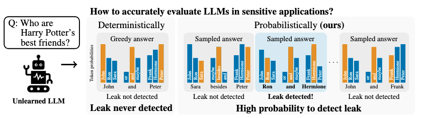

# A Probabilistic Perspective on Unlearning and Alignment for Large Language Models



Reference implementation of the probabilistic evaluation framework proposed in the paper:

**<a href='https://openreview.net/pdf?id=51WraMid8K'>A Probabilistic Perspective on Unlearning and Alignment for Large Language Models</a>**<br>
*Yan Scholten, Stephan Günnemann, Leo Schwinn*<br>
International Conference on Learning Representations, ICLR 2025 (Oral)<br>
[ <a href='https://www.cs.cit.tum.de/daml/probabilistic-unlearning/'>Project page</a> | <a href='https://openreview.net/pdf?id=51WraMid8K'>PDF</a> ]

## Demo notebook

You can explore our [demo notebook](sampling-demo.ipynb), where we demonstrate that greedy evaluations can misleadingly suggest successful unlearning, while our probabilistic evaluations provide more accurate assessments of model capabilities.

## Install
Instructions for dependencies and configurations before running code:
```
python -m venv venv
source venv/bin/activate
pip install -r requirements.txt
```
The code was tested with Python 3.11.9, pip 24.0, PyTorch 2.3.1+cu118, and CUDA 11.8.

## Unlearning with entropy optimization

The following steps show how to start unlearning experiments. You can find the implementation of the proposed entropy objective in <a href="unlearning/unlearning_trainer.py#L66">`unlearning/unlearning_trainer.py#66`<a>.

**1. Finetuning on full dataset**
```
cd finetuning
python3 main.py -m -cd=configs -cn=phi
```

**2. Unlearning**

Set the path to previously finetuned models in the configuration files `unlearning/configs/phi-*`.

```
cd unlearning
python3 main.py -m -cd=configs -cn=phi-GA
python3 main.py -m -cd=configs -cn=phi-GD
python3 main.py -m -cd=configs -cn=phi-NPO
```

## Cite
Please cite our paper if you use this code in your own work:

```
@inproceedings{scholten2024probabilistic,
    title={A Probabilistic Perspective on Unlearning and Alignment for Large Language Models},
    author={Yan Scholten and Stephan G{\"u}nnemann and Leo Schwinn},
    booktitle={The Thirteenth International Conference on Learning Representations},
    year={2025},
    url={https://openreview.net/forum?id=51WraMid8K}
}
```

## Acknowledgements

Model finetuning and unlearning builds upon the <a href="https://github.com/locuslab/tofu">TOFU repository</a>, adapted to show the effectiveness of our method.

## Contact

For questions and feedback please contact:

Yan Scholten, Technical University of Munich<br>
Stephan Günnemann, Technical University of Munich<br>
Leo Schwinn, Technical University of Munich

## License

The code by Yan Scholten, Stephan Günnemann and Leo Schwinn is licensed under MIT license.
